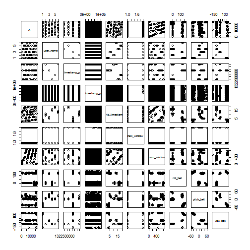
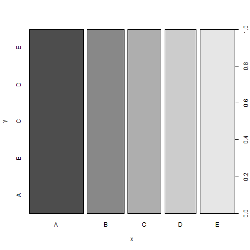

###SYNOPSIS

The aim of this exercise is to present the results of the Practical Machine Learning -Peer Assesment. This report is generated using a single R markdown file that can be processed by knitr and generate an output HTML file. The basic outline followed here is as follows-

1.Since the data set has so many columns- we have decided to make a class prediction using **Random Forests model**(there is no need to cross validate to get an unbiased estimate)

2.Before subjecting our data set to the prediction modelling - a little data cleaning has been done. All the columns with less than 60% data filled in is filtered out.

3.The model accuracy over the validating data set is 99.5 %

4.The model gives good estimates and predictions using the above model gave 20 outcomes which when submitted to the latter half of the assignment(Course project submission)- were evaluated as correct. 


####Loading and Preprocessing the data

Loading the required packages

```r
library(caret)
library(rpart)
library(randomForest)
set.seed(1111)
```

Creating training and validating data sets

```r
trainingCSV = read.csv("pml-training.csv")
```

```
## Warning: cannot open file 'pml-training.csv': No such file or directory
```

```
## Error: cannot open the connection
```

```r
inTrain <- createDataPartition(trainingCSV$classe, p=0.60, list=FALSE)
training <- trainingCSV[inTrain, ]
validation <- trainingCSV[-inTrain, ]
```

Trying to visualise the data set.

Some further exploratory analysis-to see the relationship between various variables.
Trying to see the tabular correlation matrix of the variable which are highly correlated.


```r
pairs(training[1:10000,1:10])
```

 


Since a lot of the columns have null/missing data it is not very useful to use them in our model. Thus filtering these columns out. Thus for the same firsst 10 columns we plot pairs before and after excluding the data. This can help us show resonable comparison.


```r
goodVar<-c((colSums(is.na(training[,-160])) >= 0.4*nrow(training)),160)
training<-training[,goodVar]
dim(training)
```

```
## [1] 11776    68
```

```r
validation<-validation[,goodVar]
dim(validation)
```

```
## [1] 7846   68
```

```r
training<-training[complete.cases(training),]
dim(training)
```

```
## [1] 11776    68
```

```r
##pairs(training[1:10000,1:10])
```


Applying Random forest training on the train set-


```r
model <- randomForest(classe~.,data=training)
print(model)
```

```
## 
## Call:
##  randomForest(formula = classe ~ ., data = training) 
##                Type of random forest: classification
##                      Number of trees: 500
## No. of variables tried at each split: 8
## 
##         OOB estimate of  error rate: 0.01%
## Confusion matrix:
##      A    B    C    D    E class.error
## A 3348    0    0    0    0   0.0000000
## B    0 2279    0    0    0   0.0000000
## C    0    1 2053    0    0   0.0004869
## D    0    0    0 1930    0   0.0000000
## E    0    0    0    0 2165   0.0000000
```


```r
head(importance(model))
```

```
##     MeanDecreaseGini
## X              108.8
## X.1            151.0
## X.2            151.4
## X.3            106.3
## X.4            122.3
## X.5            133.4
```


Evaluating the model on the evaluation dataset.


```r
plot(predict(model,newdata=validation[,-ncol(validation)]),validation$classe)
```

 


```r
confusionMatrix(predict(model,newdata=validation[,-ncol(validation)]),validation$classe)
```

```
## Confusion Matrix and Statistics
## 
##           Reference
## Prediction    A    B    C    D    E
##          A 2232    0    0    0    0
##          B    0 1518    0    0    0
##          C    0    0 1368    0    0
##          D    0    0    0 1286    1
##          E    0    0    0    0 1441
## 
## Overall Statistics
##                                     
##                Accuracy : 1         
##                  95% CI : (0.999, 1)
##     No Information Rate : 0.284     
##     P-Value [Acc > NIR] : <2e-16    
##                                     
##                   Kappa : 1         
##  Mcnemar's Test P-Value : NA        
## 
## Statistics by Class:
## 
##                      Class: A Class: B Class: C Class: D Class: E
## Sensitivity             1.000    1.000    1.000    1.000    0.999
## Specificity             1.000    1.000    1.000    1.000    1.000
## Pos Pred Value          1.000    1.000    1.000    0.999    1.000
## Neg Pred Value          1.000    1.000    1.000    1.000    1.000
## Prevalence              0.284    0.193    0.174    0.164    0.184
## Detection Rate          0.284    0.193    0.174    0.164    0.184
## Detection Prevalence    0.284    0.193    0.174    0.164    0.184
## Balanced Accuracy       1.000    1.000    1.000    1.000    1.000
```


```r
accurate<-c(as.numeric(predict(model,newdata=validation[,-ncol(validation)])==validation$classe))
accuracy<-sum(accurate)*100/nrow(validation)
accuracy
```

```
## [1] 99.99
```
We try and apply our model to the testing csv provided. But before that we pply the same transformations we used on the training sets


```r
testing =  read.csv("pml-testing.csv")
```

```
## Warning: cannot open file 'pml-testing.csv': No such file or directory
```

```
## Error: cannot open the connection
```

```r
dim(testing)
```

```
## [1] 20 68
```

```r
testing<-testing[,goodVar]
```

```
## Error: undefined columns selected
```

```r
dim(testing)
```

```
## [1] 20 68
```


Saving the predictions and creating functions to save the output files for the prediction assignment submission.
Since we had a good accuracy of the model made all the 20 submissions are correct.


```r
predictions<-predict(model,newdata=testing)


# pml_write_files = function(x){
#   n = length(x)
#   for(i in 1:n){
#     filename = paste0("./answers/problem_id_",i,".txt")
#     write.table(x[i],file=filename,quote=FALSE,row.names=FALSE,col.names=FALSE)
#   }
# }
# 
# pml_write_files(predictions)
```


Thank you for reading

------Have a good day-----

